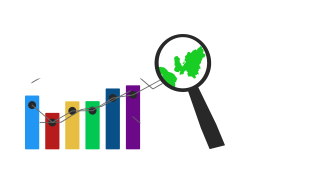

[](https://sonarcloud.io/dashboard?id=mecassauro_RADAR-frontend)
[](https://sonarcloud.io/dashboard?id=mecassauro_RADAR-frontend)
[](https://sonarcloud.io/dashboard?id=mecassauro_RADAR-frontend)
[](https://sonarcloud.io/dashboard?id=mecassauro_RADAR-frontend)
[](https://travis-ci.org/mecassauro/RADAR-frontend)

# SiMAPS Aplicativo

<p align="center">
  
</p>

Aplicativo do projeto SiMAPS. Tem como público alvo a comunidade do DF.

## Tecnologias utilizadas

1. [React Native](https://reactnative.dev/)

## Rodando da aplicação

1) Instalação do React Native, disponível [aqui] (https://reactnative.dev/docs/environment-setup)

2) Clone o repositório:

    ```
    git clone https://github.com/simaps-ubs/simaps-app.git
    ```

3) Instale as dependências:
  
    ```
    npm install
    ``` 

4) Rode o aplicativo com o emulador de sua preferência.

## Análise estática do código

[](https://sonarcloud.io/dashboard?id=mecassauro_RADAR-frontend)

 ## Como contribuir com o projeto?

 <details><summary><b>Contribuição</b></summary>
 1. <a href="https://github.com/mecassauro/RADAR-frontend/blob/master/docs/CONTRIBUTING.md">Guia de Contribuição</a>
 </details>

<details><summary><b>Código de Conduta</b></summary>
1. <a href="https://github.com/mecassauro/RADAR-frontend/blob/master/docs/CODE_OF_CONDUCT.md">Código de Conduta</a>
</details>

<details><summary><b>Políticas de Contribuição</b></summary>
1. <a href="https://github.com/mecassauro/docs/blob/master/docs/gcs.md">Política de branchs/commits/</a>
</details>


